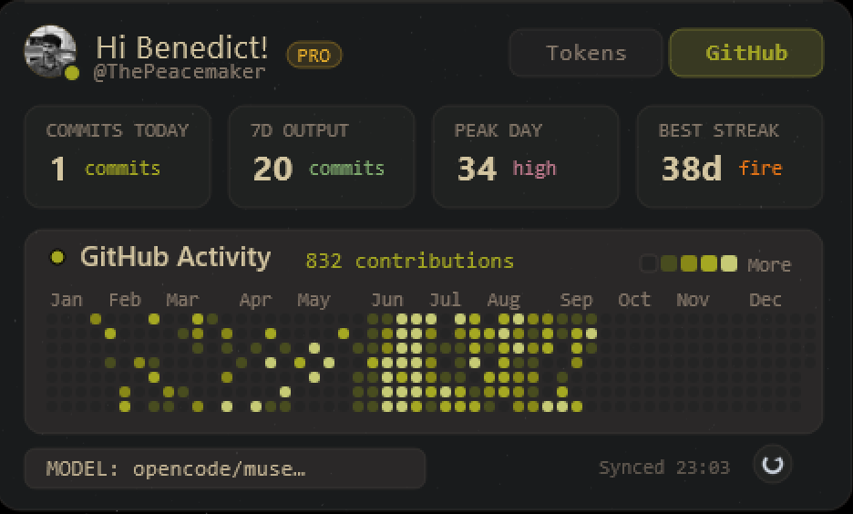

# ⚡ CodeTracker Widget


Your **real** OpenCode usage and **real** GitHub contributions — on your
desktop and in your browser. No mock data. No estimates. Every number is
traced to the source.



## Two widgets, one truth

|                    | 🖥️ Desktop (Rainmeter) | 🌐 Web (React) |
| ------------------ | ---------------------- | -------------- |
| Lives in           | `desktop/`             | repo root (`src/`) |
| Look               | Gruvbox-dark glass card, 470px side widget | Liquid-glass widget, light + dark |
| Views              | Tokens / GitHub tabs   | Tokens / GitHub views |
| Heatmap            | Jan–Dec year grid, per-cell hover tooltips | Full heatmap with hover details |
| Extras             | Click-to-copy stat cards, live spend footer, one-click ⟳ refresh | Embed modal, live streamer simulation |
| Data               | `desktop/data/usage.json` + generated skin files | `public/usage.json` (same snapshot) |

## Why it's accurate

Most dashboards guess. This one doesn't:

- **Message-ledger accounting** — the collector replays every message in
  your OpenCode database and lands each token on the day it was actually
  spent. Cross-checked: message totals equal session totals **to the exact
  token**. Long-running sessions can no longer inflate their start day.
- **Today's top model, for real** — resolved from today's messages, so an
  all-night session never steals credit from what you're running now.
- **Live GitHub data** — contribution calendar via the GraphQL API
  (total == sum of daily, verified on every run).
- **Session costs split pro-rata** across the days each session was active.

## Quickstart

### Web widget

```sh
npm install
npm run dev      # http://localhost:3000
npm run build    # production build in dist/
```

The app loads `public/usage.json` on start and on every refresh, and
falls back to built-in mock data only when the file is missing (offline
demo).

Or launch the built app chromeless with `desktop/Start-Widget.bat`.

### Desktop widget

1. Install [Rainmeter](https://www.rainmeter.net/).
2. Copy `desktop/skin/OpenCodeWidget` into `Documents\Rainmeter\Skins\`.
3. Tray icon → Skins → Refresh all → activate **OpenCodeWidget**.
4. Click **⟳** any time to re-collect live data. Full guide:
   [`desktop/README.md`](desktop/README.md).

### Refresh the data

```sh
python desktop/collector/collect_opencode.py
```

Reads a WAL-safe snapshot of `~/.local/share/opencode/opencode.db` plus
the GitHub API (token from `auth.json`, sent only to `api.github.com`),
then rewrites `usage.json` and every skin data file. Override paths with
`OPENCODE_DB` / `OPENCODE_AUTH`. **Never commit `auth.json`.**

## How it fits together

```
opencode.db ──┐
              ├─► collector ─┬─► desktop/data/usage.json ─► Rainmeter skin
github API ───┘              ├─► skin/@Resources/* (vars + 736 cells)
                             └─► public/usage.json ───────► React web app
```

## Project structure

```
├── src/                    React web widget (components, realData adapter)
├── public/usage.json       live snapshot served to the web app
├── desktop/                Rainmeter widget + Python collector (see its README)
│   ├── collector/          message-ledger data pipeline
│   ├── skin/               OpenCodeWidget skin + generated resources
│   └── data/               latest usage snapshot
├── assets/                 screenshots
└── .github/workflows/      CI (lint + build)
```

## Tech

React 19 · Vite 6 · Tailwind 4 · TypeScript · Rainmeter · Python (sqlite3, Pillow) · GitHub GraphQL

## Contributing

PRs welcome — see [CONTRIBUTING.md](CONTRIBUTING.md). Run `npm run lint`
and `npm run build` before pushing; keep every number traceable to a real
source.

## License

MIT — see [LICENSE](LICENSE).
